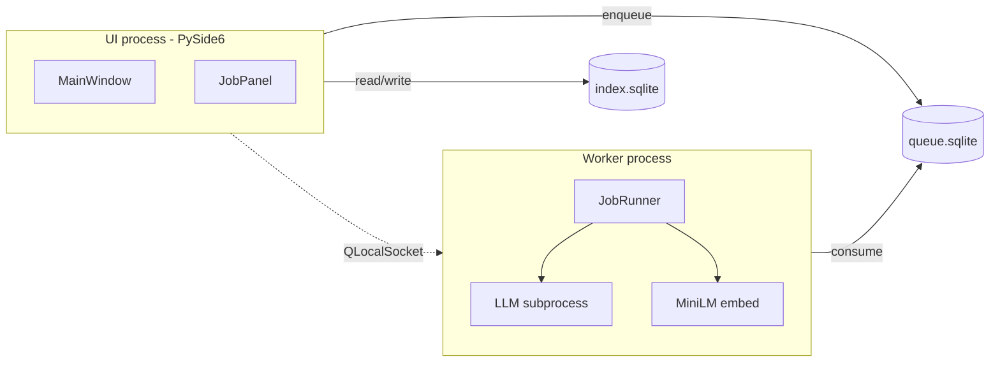

# Architecture overview

See [common-language.md](../../common-language.md) for domain language terms. See [CONTEXT.md](../../CONTEXT.md) for doc index.

## Processes



- **UI:** no llama.cpp / heavy ML imports.
- **Worker:** lazy spawn on first AI job; idle shutdown ~5 min.
- **Single PyInstaller bundle:** same binary, different entry module (`lexiflow-ui` vs `lexiflow-worker`).

## Packages

| Package | Responsibility |
|---------|----------------|
| `lexiflow-core` | Domain, storage, migrations, job queue, LLM/embed abstractions, prompts |
| `lexiflow-ui` | Qt UI, onboarding, worker supervisor, single-instance |
| `lexiflow-worker` | Thin `main()` → core job runner loop |

## Data on disk

**App config directory** (machine-local; OS-specific path):

```
settings.toml          # global settings, including data_root pointer
```

**Data root** (default `~/LexiFlow/`; user library, portable via backup zip):

```
~/LexiFlow/
  .app/
    index.sqlite
    queue.sqlite
    models/
    spacy/
    logs/
  .trash/
  es/
    .data/
      language.json
      vocabulary.sqlite
      text_vectors.sqlite
    news/
      el-pais-a3f2/
        meta.json
        native.md
        translated.md
        simplified-a2.md
```

## External dependencies

- **Hugging Face:** Gemma 4 E2B, MiniLM, spaCy packs (`models.lock` pins revisions).
- **Ollama (optional):** replaces embedded LLM only; embeddings always local.

## Testing strategy

- **core:** headless pytest + `FakeLLM` / `FakeEmbedder`; 80% coverage.
- **ui:** pytest-qt smoke + fakes; 60% coverage.
- **No real model downloads in PR CI.**
