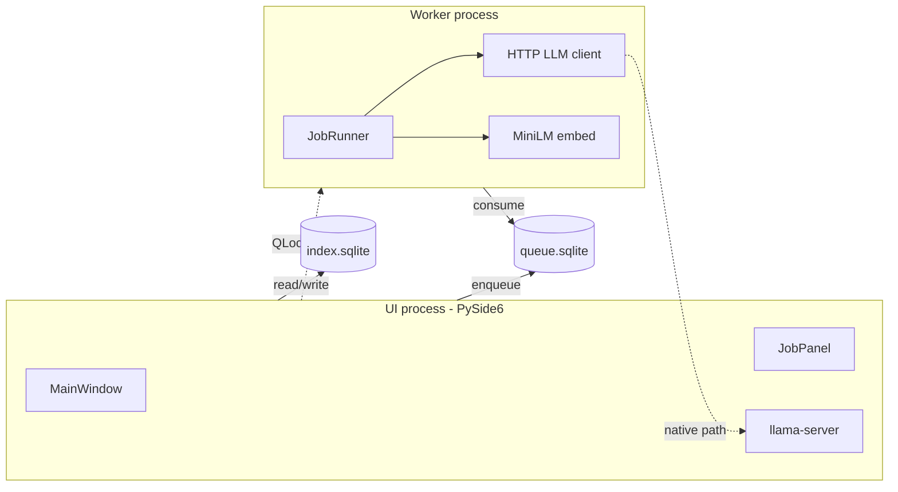

# Architecture overview

See [common-language.md](../../common-language.md) for domain language terms. See [CONTEXT.md](../../CONTEXT.md) for doc index.

## Processes


```mermaid
flowchart LR
  subgraph ui [UI process - PySide6]
    MainWindow
    JobPanel
    LlamaSrv[llama-server]
  end
  subgraph worker [Worker process]
    JobRunner
    HttpLLM[HTTP LLM client]
    Embed[MiniLM embed]
  end
  Queue[(queue.sqlite)]
  Index[(index.sqlite)]
  ui -->|enqueue| Queue
  worker -->|consume| Queue
  ui -->|read/write| Index
  JobRunner --> HttpLLM
  JobRunner --> Embed
  HttpLLM -.->|native path| LlamaSrv
  ui -.->|QLocalSocket| worker
```

- **UI:** no torch/transformers; supervises `llama-server` on the native LLM path.
- **Worker:** lazy spawn on first AI job; idle shutdown ~5 min.
- **Single PyInstaller bundle:** same `LexiFlow` executable; UI by default, worker via `--worker` ([packaging.md](../../packages/lexiflow-ui/docs/concepts/packaging.md), [ADR-0008](../adr/0008-pyinstaller-release-bundle.md)).

## Packages

| Package | Responsibility |
|---------|----------------|
| `lexiflow-core` | Domain, storage, migrations, job queue, LLM/embed abstractions, prompts |
| `lexiflow-ui` | Qt UI, onboarding, worker supervisor, single-instance |
| `lexiflow-worker` | Thin `main()` → core job runner loop |

## Data on disk

**App config directory** (machine-local; OS-specific path):

```
settings.toml          # global settings, including data_root pointer
```

**Data root** (default `~/LexiFlow/`; user library, portable via backup zip):

```
~/LexiFlow/
  .app/
    index.sqlite
    queue.sqlite
    models/
    spacy/
    logs/
  .trash/
  es/
    .data/
      language.json
      vocabulary.sqlite
      text_vectors.sqlite
    news/
      el-pais-a3f2/
        meta.json
        native.md
        translated.md
        simplified-a2.md
```

## External dependencies

- **Hugging Face:** pinned native LLM GGUF (via llama-server), MiniLM, spaCy packs (`models.lock` pins revisions).
- **Ollama (optional):** replaces native LLM only; embeddings load via `sentence-transformers` unless phase 10b adds Ollama embed.

## Testing strategy

- **core:** headless pytest + `FakeLLM` / `FakeEmbedder`; 80% coverage.
- **ui:** pytest-qt smoke + fakes; 60% coverage.
- **No real model downloads in PR CI.**
