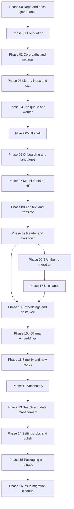

# LexiFlow roadmap

**Bootstrap:** Phase 00 commits **directly to `main`** (governance only, no PR).

**Rule (v1, phase 01+):** one phase = one GitHub Issue = one PR = one merge to `main`.

Until v1 ships, each feature phase has a **GitHub Issue** (minimal body: link + blockers) and a **phase README** (full spec). Issues use **blocked by** for order (01 → 15; phase **17** UI cleanup is parallel after 09-2). **Insert phases** (e.g. **10b**, **09-2**) slot mid-roadmap without renumbering downstream phases. After [phase 16](phases/phase-16-issue-migration-cleanup/), specs move into closed issues and phase folders leave the repo.

See [agent workflow](../guides/agent-workflow.md).

## Phase diagram

## Phase index

| Phase | Folder | Outcome (what you have after merge) |
|-------|--------|-------------------------------------|
| 00 | [phase-00-repo-governance](phases/phase-00-repo-governance/) | GitHub repo, AGENTS/CONTRIBUTING, CI skeleton, PR Plan rule |
| 01 | [phase-01-foundation](phases/phase-01-foundation/) | uv monorepo, hello window, CI green |
| 02 | [phase-02-core-paths-settings](phases/phase-02-core-paths-settings/) | **Data root**, **global settings**, **schema migration** |
| 03 | [phase-03-library-and-texts](phases/phase-03-library-and-texts/) | **Groups**, **text storage layout**, **library index** |
| 04 | [phase-04-job-queue-worker](phases/phase-04-job-queue-worker/) | **Job queue**, worker, **background jobs** |
| 05 | [phase-05-ui-shell](phases/phase-05-ui-shell/) | **Application shell**, **sidebar**, **single instance** |
| 06 | [phase-06-onboarding-languages](phases/phase-06-onboarding-languages/) | **Onboarding flow**, **language catalog** |
| 07 | [phase-07-model-bootstrap](phases/phase-07-model-bootstrap/) | **Model bootstrap**, **model pinning** |
| 08 | [phase-08-add-text-translate](phases/phase-08-add-text-translate/) | **Add text flow**, **staged generation** |
| 09 | [phase-09-reader-markdown](phases/phase-09-reader-markdown/) | **Reader tabs**, **read mode**, **edit mode** |
| 09-2 | [phase-09-2-ui-theme-migration](phases/phase-09-2-ui-theme-migration/) | **UI theme** strategy, shell **UI theme migration** ([ADR 0006](../adr/0006-desktop-ui-theme-strategy.md)) |
| 17 | [phase-17-ui-cleanup](phases/phase-17-ui-cleanup/) | **UI cleanup checklist**: sidebar tree, language switcher, shell alignment |
| 10 | [phase-10-embeddings](phases/phase-10-embeddings/) | **Vector storage**, **embedding queue** (MiniLM baseline) |
| 10b | [phase-10b-ollama-embeddings](phases/phase-10b-ollama-embeddings/) | **Ollama embedder**; skip MiniLM when Ollama configured ([ADR 0005](../adr/0005-ollama-embedding-provider-deferred.md)) |
| 11 | [phase-11-simplify](phases/phase-11-simplify/) | **Simplify word mix**, **new word suggestions** |
| 12 | [phase-12-vocabulary](phases/phase-12-vocabulary/) | **Vocabulary study**, export/import |
| 13 | [phase-13-search-data](phases/phase-13-search-data/) | **Global search UI**, **trash**, **library backup** |
| 14 | [phase-14-settings-polish](phases/phase-14-settings-polish/) | **Jobs panel**, **settings**, **reset app** |
| 15 | [phase-15-packaging-release](phases/phase-15-packaging-release/) | **Packaging**, **installers**, **release process** |
| 16 | [phase-16-issue-migration-cleanup](phases/phase-16-issue-migration-cleanup/) | Specs copied into closed issues; roadmap phase folders removed; post-v1 issue-only workflow |

## GitHub issues (v1, phases 01–15, 09-2, 17)

Create after phase 00 is on `main`, from [phase issue template](../../.github/ISSUE_TEMPLATE/phase.yml) (or `phase.md`). No issue for phase 00.

Phase **09-2** is a **mid-roadmap insert**: one issue ([#27](https://github.com/YannikG/lexiflow/issues/27)), one PR, **blocked by** phase 09. Delivers **UI theme** ADR and migration spec. **Blocks** phase 17 only; phase 10 (embeddings) may proceed in parallel after phase 09.

Phase **17** is a **UI cleanup** track: one issue, one PR, checklist-driven. **Blocked by** phase **09-2** (themed baseline before tree/switcher work). Optional before phase 10 when the team prioritises shell alignment over embeddings (`P17 --> P10` in the diagram).

Create labels **`phase`** and **`v1`** on GitHub before using the form (or add them manually per issue).

Each issue:

- **Title:** `Phase XX: <name>` (insert phases: `Phase 9-2: …`, `Phase 10b: …`)
- **Body:** link to `docs/roadmap/phases/phase-XX-.../README.md` only
- **Blocked by:** previous phase issue (phase 01 has no blocker; insert phases declare **Blocked by** / **Blocks** in their README)

Enable branch protection on `main` before merging the first feature PR (phase 01).

## References

- [Context map](../../CONTEXT.md)
- [Domain language (common-language.md)](../../common-language.md)
- [Architecture overview](../architecture/overview.md)
- [ADRs](../adr/)
- [Agent workflow](../guides/agent-workflow.md)
- [Documentation strategy](../guides/documentation-strategy.md)
- [PR plan template](../guides/pr-plan-template.md)

## v1 scope reminder

Public-ready desktop app: full learning loop (texts → translate → simplify → vocabulary → search). Not a minimal throwaway prototype. See common-language **Release bar**.
